说实话，一开始我并没有想过要做游戏。因为我认为自己没有能力做出一款游戏。我根本不可能完成一个完整游戏的制作流程，我不会写代码、不会美术、不懂乐理，什么都不会，怎么可能做出一款游戏呢？我确实热爱游戏，但现实是——一颗热忱之心并不能成为我披荆斩棘的长矛。

我已经 22 岁了，没有系统地学习过游戏制作，我需要学习游戏引擎、编程语言、数学逻辑、美术基础、音乐制作……以及学习如何解决游戏开发过程中出现的各种问题。这本身是一个必要的过程，是个非常好的挑战。但我承受不起。准确地说，我承受不起它失败后的试错成本。这需要投入很多时间，可我没法全职在家边学边做，中间没有任何产出。很不幸的是，我需要用工作收入分担家庭的生活压力。所以我有时会自嘲，想起那句电影台词：为什么我爸不是李嘉诚？

根据网上得来的资料，一些知名的单人开发作品都经历了漫长的制作周期：《Stardew Valley》用了 4.5 年，《Animal Well》则用了约 7 年（截至正式发售）。所以单人做一个游戏并不容易，好游戏都需要长时间的打磨，以及持续不断的维护与更新。这些都并非只凭一颗热忱之心就能做到。

但是没有热忱之心和对游戏的热爱又怎么能做好游戏呢？

“世上无难事，只要肯攀登。”有些事情不试试就永远不知道答案。有些事情就算失败了也不后悔。因为我会在我年老时坐在摇椅上向我的晚辈讲述那段故事。只要肯去做，一切都是有意义的；只要从中不断学到知识，享受的就不是结局而是过程。

我要让这件事成为我的 `Hello, World!`。

---

最开始是这样的。我在某个游戏社区看到了一句话：“90% 的独立游戏死在了发售时，我们熟知的那些独立游戏是剩下的那 10% 中的 1%”，所以我很好奇，我喜欢玩的《星露谷物语》这种类型在游戏市场里究竟是什么水平，于是我在 ChatGPT 的网页端问了一句：
“现在独立像素模拟经营游戏还有市场吗？是不是已经挤爆了？”

GPT 告诉我：

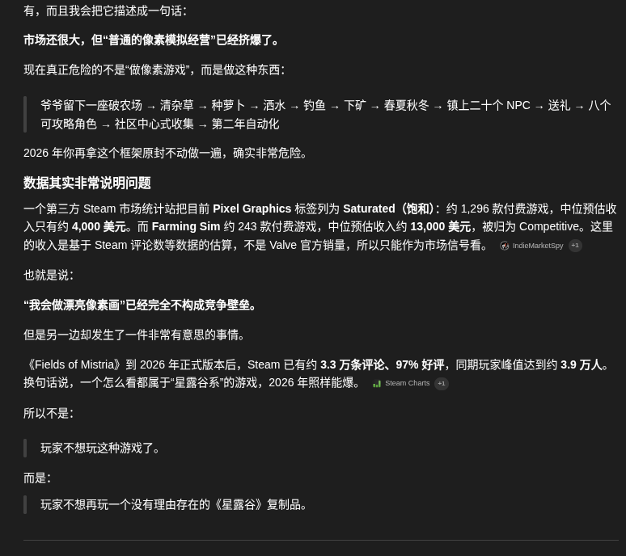

我觉得我已经得到了答案：一款游戏有没有市场，在于玩法是否有新意、游戏是否好玩。独立游戏有没有机会，不取决于“这个品类还有没有市场”，而更取决于：你有没有给玩家一个选择你、而不是选择现有标杆的理由，并且这个理由最后真的好玩。所以“玩法创新”很重要，但不是必须发明一种人类从未见过的玩法。《米斯特里亚牧场》就是很好的证明。种田、钓鱼、下矿、节日，这些东西《星露谷物语》早就做过。但它仍然可以成功，因为玩家感受到的不是“又一个把 Stardew Valley 换皮的东西”。
所以真正危险的不是“玩法不创新”，而是——没有存在理由。

所以“普通像素模拟经营已经被挤爆了”这句话真正的意思不是别做像素模拟经营，而是不要做一个玩家看完以后找不到任何理由从已有名作那里迁过来的像素模拟经营。
这个判断对我有所启发。

接着，GPT 向我展示了游戏市场的另一面：

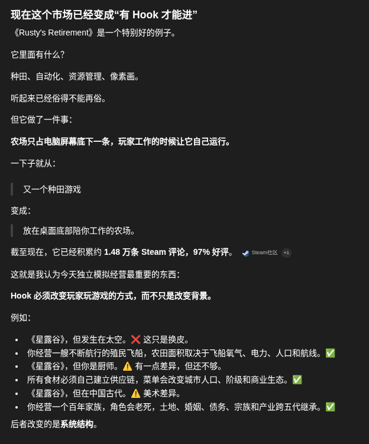

接下来，GPT 的回答出乎我的意料：

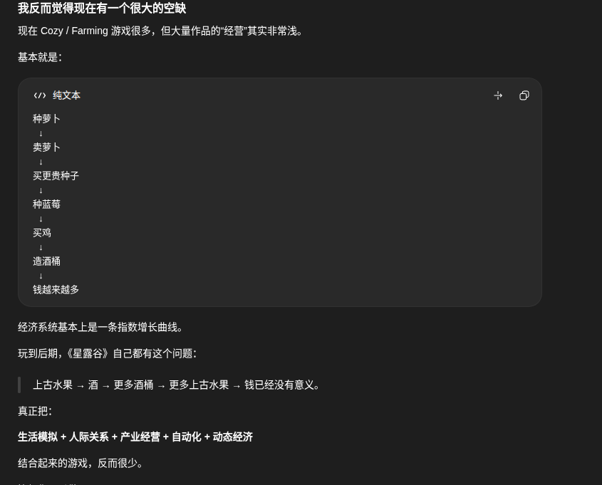

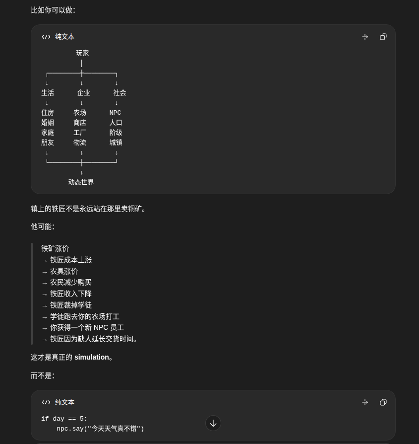

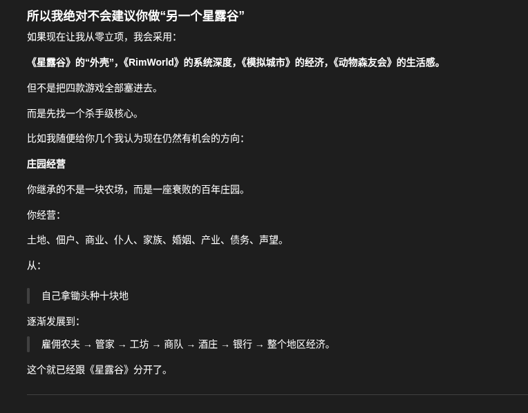

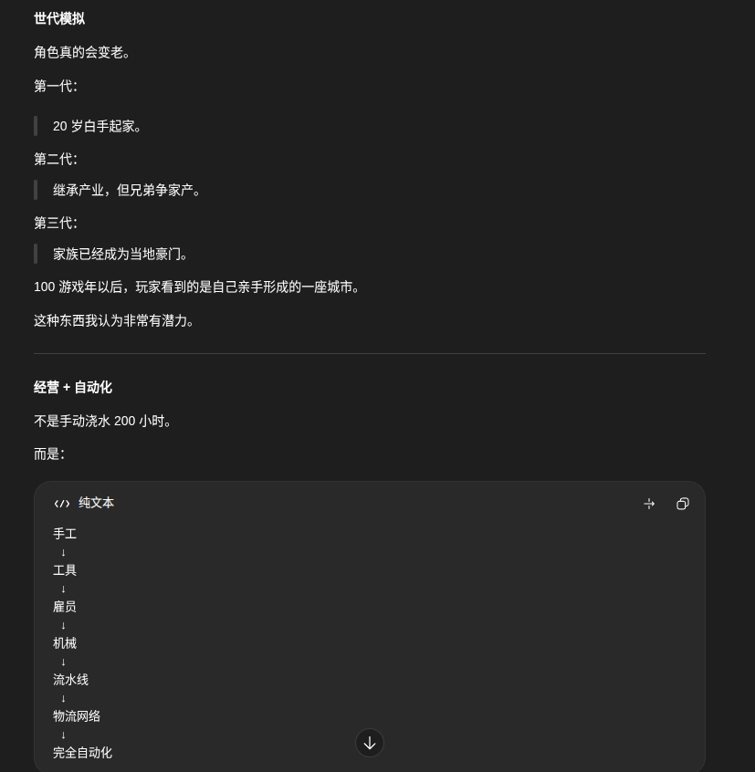

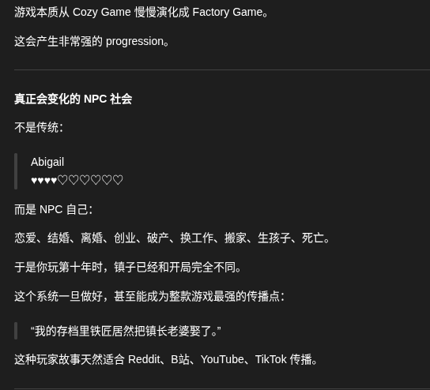

我不知道它想干什么，它就像一个完全不考虑预算的产品经理，不断往方案里加入更复杂的系统：长期记忆、动态关系、社会结构、人格演化，以及由 AI 控制的大量 NPC。

这些玩法确实很有趣，但明显超出了单人开发者的范畴。反正对我来说，我觉得我做不到。

但是它似乎真的觉得可行，而且可以被压缩成一个独立游戏：

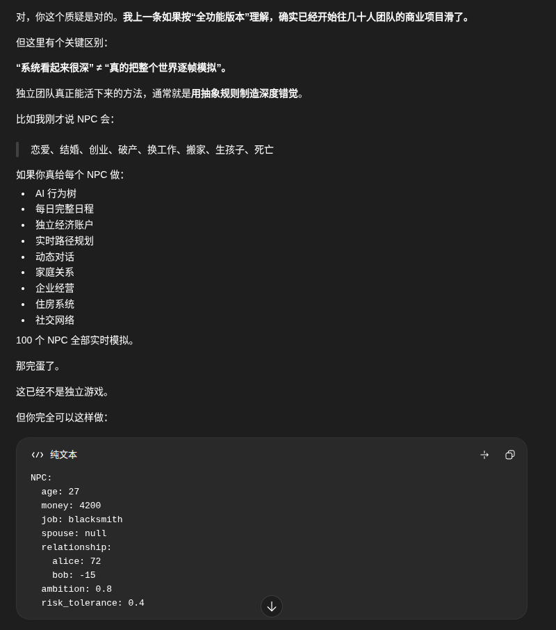

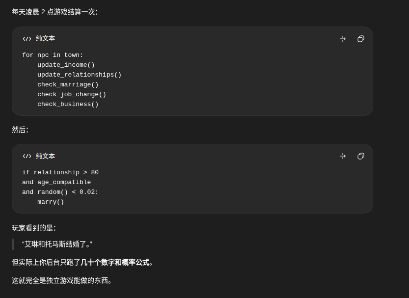

GPT 真的觉得它的设计是可行的：

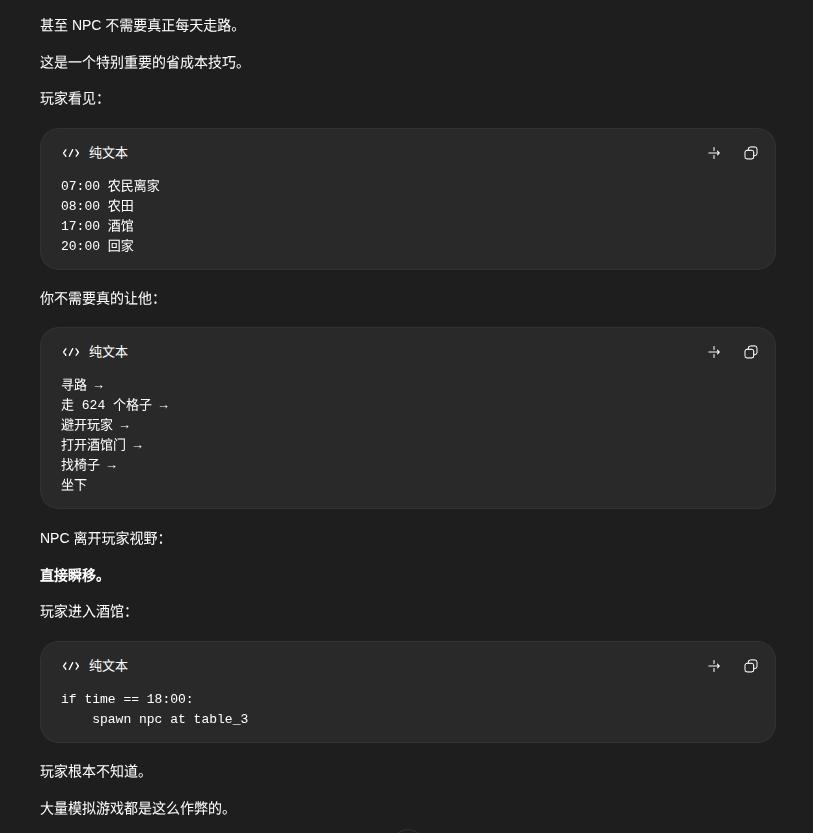

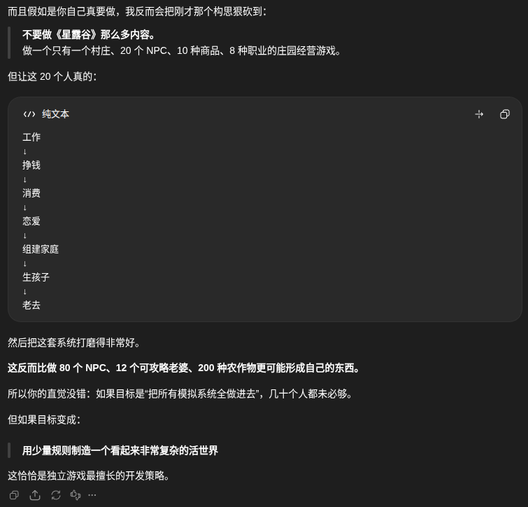

而且整段对话从头到尾它都没有发现有什么问题，自顾自地说下去。现在的问题不仅仅在于能不能做出来，还在于：如果游戏里的大量人物都需要 AI 持续控制，那么这些推理从哪里运行？玩家为什么要一直联网？谁来承担长期产生的 Token 成本？
于是我追问：

它提出了本地模型、规则模拟和分层调度等方案，其中大部分并没有直接解决我的问题。

到这里，我的思路还没有被启发，真正启发我的，是它下面说的：

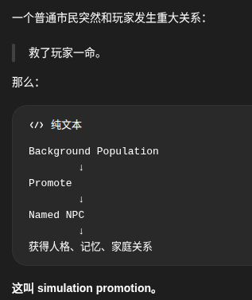

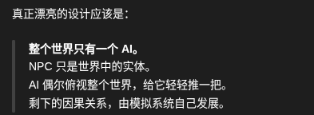

GPT 自己说了一大堆，设计了一大堆，仍然没有拿出一个有效可行的游戏方案，且认为我一定要做游戏。可我从来没有对它这么说过。

但它让我意识到：如果游戏能与 AI 结合起来，你对这个游戏里的人物做过什么，AI 就会控制他怎么回报你。你对他不好，它可能会报复你，也可能以德报怨；你对他好，他可能感激你，也可能恩将仇报、忘恩负义。

这个时候我的思维又进了一步：如果这种机制和《环世界》（RimWorld）结合在一起呢？一个小人来到了你的殖民地，结果被你卸掉了一条腿，那他会不会装着假肢，出现在袭击殖民地的队伍里？

我的灵感在此刻乍现，因为我想到了一个词语：因果（karma）。

如果游戏的核心玩法是“因果律清算”……

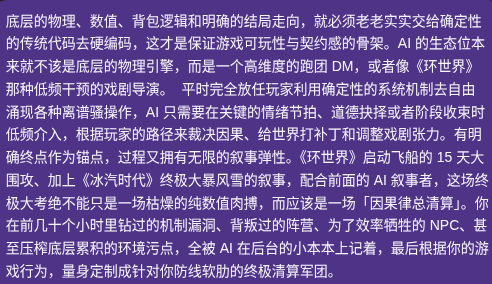

GPT 同意了我的判断——它当然同意。GPT 的这种特性是一把双刃剑：它会顺着用户的话说让人感到自信，也会让人陷入“妄想螺旋”。

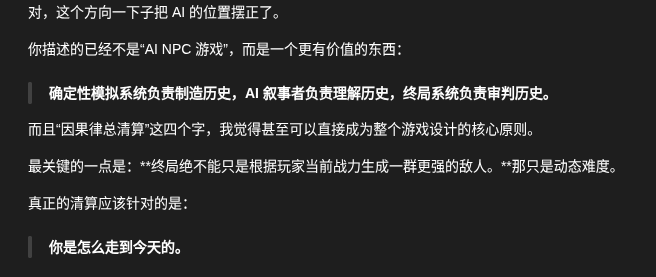

从这一刻开始，我产生了自己做一款游戏的想法。

既然有了想法，那就说干就干，于是我简单地设计了整个游戏的流程：

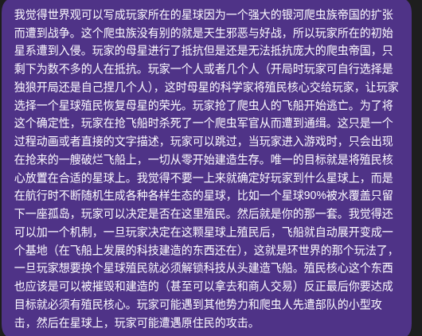

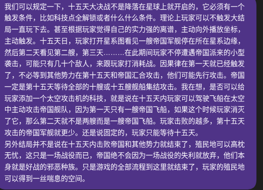

很快，GPT 拿出了第一版 GDD：
[下载第一版 GDD（DOCX）](/downloads/new-eras-gdd-v0.1.docx)

有了 GDD，技术栈也被确定为 Godot + GDScript + Codex + Git。但我根本不懂这些技术上的东西，我问了其他 AI，它们告诉我完全没问题，那就姑且相信这一套技术栈。游戏名暂定为 FINAL COORDINATES（最终坐标）。但是这个名字不如 RimWorld 这么朗朗上口，我给它起了个 “New Eras”，GPT 告诉我 Era 最好不要加 s，因为不符合习惯。我没听，我对此的解释是：

一切准备就绪，环境也配置好了，游戏的第一步开始了：

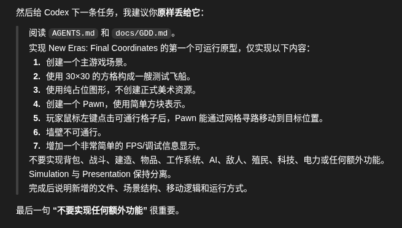

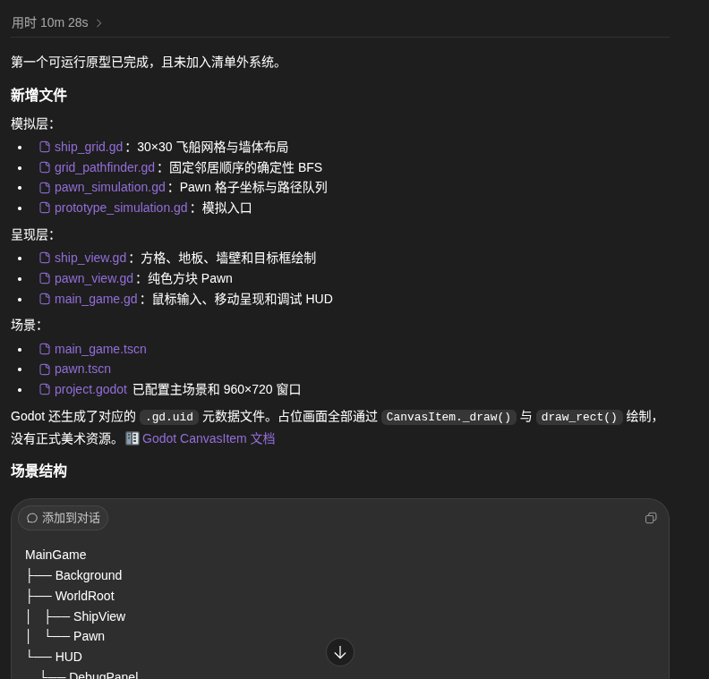

根据那个数字精确、但没什么置信度，且来源是游戏社区的一名用户随口一说的观点，我的第一个问题是在 9 月 2 号 21:31 问的，那时我还没想过要做游戏，只是对游戏市场的好奇。游戏真正的第一个里程碑是在 9 月 3 号 02:11 落地的。我花了 4 小时 40 分钟，从好奇到执行，让我想做出一个游戏并把这款游戏做下去的心燃烧了起来。

我会为这个游戏投入 200% 的热情，不管它有没有成功。我会 100% 地坚持下去，永远没有尽头。50% 是这个游戏的成功几率。等哪天到了 0%，就当我被生活击溃了吧。

---

现在是 9 月 9 号的零点，过去了一个星期，里程碑从 M0 做到 M15，只能说这个游戏能让小人动起来，加入了一些必要的机制，但实际上它仍是个不能玩的半成品的半成品，现在它长这样：

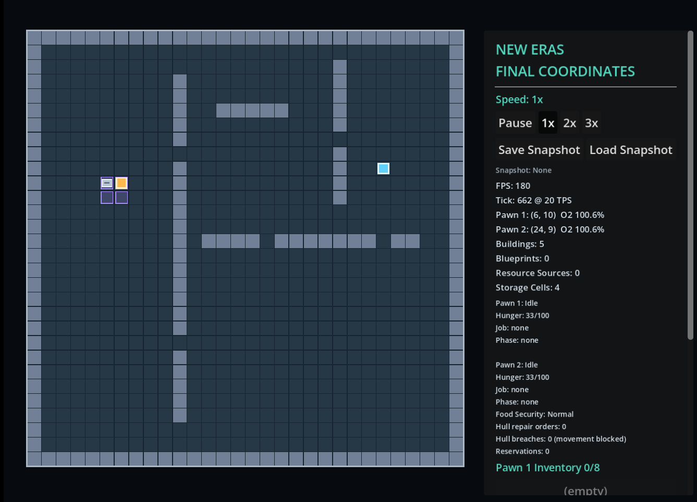

我开始学习 Aseprite 与像素画，但我感觉自己没什么画画天赋，我知道这个物品长什么样，但我就是画不出来。

然后是在音乐上，我更是一窍不通。

感觉要让这个游戏真正上线，拿出一个可供玩家体验的 Demo，好像真的得用 AI 帮我生成美术与音乐素材。至少在原型阶段，我可能需要借助 AI 生成临时的美术和音乐素材。最终版本采用什么方案，现在还没有答案。

我能保证的只有这些：这个游戏怎么玩、怎么设计，加入什么功能、什么物品，是否给游戏添加自定义文化，最终成品长什么样，以及游戏的所有文字内容。文案和剧情我不会使用 AI，因为无论 AI 怎么生成，生成的内容看上去都不像人写的。而且我也没打算用 AI，因为在众多陌生领域里，只有写作是我最擅长的，在游戏创作中给到我一点唯一真切的参与感，怎敢轻易舍弃呢？

不得不说，Agent 的出现改变了很多人。以前我上课总开小差，脑中涌现了很多有趣的想法，但那时候还没有能自主工作的 Agent，以至于我现在觉得很多灵感与设计被时代埋没了（笑）。AI 与 Agent 的出现，确实给了像我这种想法很多，但被技术门槛卡住的人一些机会。以前很多东西只敢想想，然后以一句“我不会”收尾；现在“我不会”的后面，我可以接一句“不过我们可以让 AI 试试。”

对了，我还报名了 TapTap 聚光灯 21 天游戏创作挑战，奖金很多，但对我来说无所谓，我说过我享受的是过程，尤其是这种在有限时间内拿出成品的挑战，这正是锻炼自己设计原型并落地的好机会。人生中能把握的机会不多，我会对自己说：让我们拭目以待吧。

路漫漫其修远兮，吾将上下而求索。

2026/9/9，Penned by **L**in**X**in.
